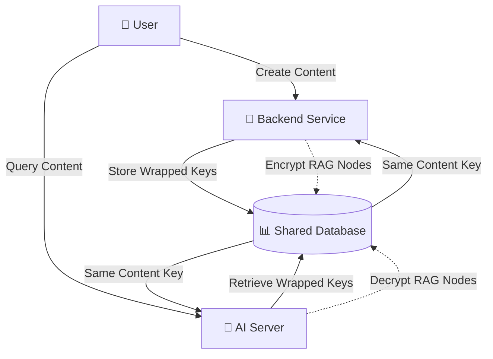

# Key Sharing Architecture: Backend ↔ AI-Server 🔐

## 🎯 **CRITICAL REQUIREMENT**

**YES, the backend and ai-server MUST use the same keys for the same items.**

This is essential for seamless encryption/decryption across the entire RAG system. Without key sharing, encrypted content would be inaccessible between services, breaking the collaborative writing experience.

## 🏗️ **Key Sharing Architecture Overview**



## 🔑 **How Key Sharing Works**

### 1. **Content Key Generation** (Backend)
```typescript
// Backend generates content key for a universe
const contentKey = await contentKeyManager.generateContentKey(
    'universe-123',
    [
        { userId: 'user-1', publicKey: 'user1-public-key' },
        { userId: 'user-2', publicKey: 'user2-public-key' }
    ]
);

// Result: Content key wrapped for each collaborator
// Stored in shared database accessible to both services
```

### 2. **Key Retrieval** (Both Services)
```typescript
// BACKEND: Retrieve key for encryption
const key = await contentKeyManager.getContentKey(
    'universe-123', 
    'user-1', 
    'user1-private-key'
);

// AI-SERVER: Retrieve SAME key for decryption
const sameKey = await encryptedRAGService.getContentKey(
    'universe-123',
    'user-1', 
    'user1-private-key'
);

// Both services get identical content key
assert(key.equals(sameKey)); // ✅ True
```

### 3. **Synchronized Encryption/Decryption**
```typescript
// BACKEND: Encrypt RAG node during creation
const encryptedNode = await ragNodeEncryption.encrypt(
    nodeContent,
    contentKey  // Same key used by AI server
);

// AI-SERVER: Decrypt RAG node during search
const decryptedContent = await encryptedRAGService.decrypt(
    encryptedNode,
    contentKey  // Same key used by backend
);
```

## 📊 **Shared Database Schema**

### Content Keys Collection
```typescript
interface ContentKeysSchema {
    _id: ObjectId;
    universeId: string;           // Universe this key encrypts
    contentKeyId: string;         // Unique key identifier
    wrappedKeys: {                // Content key wrapped for each user
        userId: string;
        wrappedKey: string;       // Content key encrypted with user's public key
        algorithm: string;        // 'rsa-oaep'
    }[];
    metadata: {
        algorithm: string;        // 'aes-256-gcm'
        createdAt: Date;
        version: number;
    };
    status: 'active' | 'rotated' | 'revoked';
}
```

### User Keys Collection
```typescript
interface UserKeysSchema {
    _id: ObjectId;
    userId: string;
    publicKey: string;            // RSA public key
    encryptedPrivateKey: string;  // Private key encrypted with user password
    keyType: 'RSA';
    createdAt: Date;
}
```

## 🔄 **Key Sharing Workflow**

### Universe Creation
1. **User creates universe** → Backend generates content key
2. **Content key wrapped** with creator's public key
3. **Wrapped key stored** in shared database
4. **Both services can now** encrypt/decrypt universe content

### Adding Collaborators
1. **Admin adds collaborator** → Backend unwraps content key
2. **Content key re-wrapped** with new collaborator's public key
3. **Updated wrapped keys** stored in shared database
4. **New collaborator can access** encrypted content via AI server

### Content Operations
```typescript
// BACKEND: Store encrypted RAG node
const contentKey = await getContentKey(universeId, userId, userPrivateKey);
const encrypted = await encrypt(nodeContent, contentKey);
await storeRAGNode(encrypted);

// AI-SERVER: Retrieve and decrypt RAG node  
const sameContentKey = await getContentKey(universeId, userId, userPrivateKey);
const decrypted = await decrypt(encryptedNode, sameContentKey);
return decrypted; // Same content as original
```

## 🛠️ **Implementation Files**

### Backend Services ✅
- `backend/src/services/encryption/base-encryption.service.ts` - Core crypto operations
- `backend/src/services/encryption/content-key-manager.service.ts` - Content key management
- `backend/src/services/encryption/collaborative-key.service.ts` - Multi-user key wrapping
- `backend/src/services/encryption/rag-node-encryption.service.ts` - RAG-specific encryption

### AI Server Services (To Be Updated)
- `ai-server/src/rag/encryption/base-encryption.service.ts` ✅ (Already exists)
- `ai-server/src/rag/services/encrypted-rag.service.ts` - Encryption-aware RAG
- `ai-server/src/rag/services/access-control.service.ts` - User permission checking

### Database Schemas (To Be Created)
- `backend/src/schemas/content-keys.schema.ts` - Content key storage
- `backend/src/schemas/user-keys.schema.ts` - User key pair storage
- `backend/src/schemas/encrypted-rag-node.schema.ts` - Encrypted RAG nodes

## 🔒 **Security Benefits**

### 1. **Zero-Knowledge Architecture**
- Server never sees unencrypted private keys
- Content keys are always wrapped (encrypted)
- No single point of failure for key compromise

### 2. **Collaborative Security**
- Each collaborator has their own key pair
- Content keys shared securely via wrapping
- Individual access can be revoked without affecting others

### 3. **Service Isolation**
- Backend and AI server use same keys but remain independent
- Compromise of one service doesn't expose raw keys
- Database stores only encrypted/wrapped keys

## 🎯 **Next Implementation Priority**

1. **Complete Backend Services** (High Priority)
   - Finish `ContentKeyManager` database integration
   - Implement `CollaborativeKeyService`
   - Create database schemas

2. **Update AI Server** (High Priority)
   - Modify existing encryption services to use shared keys
   - Implement `EncryptedRAGService`
   - Add access control checks

3. **Test Key Sharing** (Critical)
   - Unit tests for key generation/retrieval
   - Integration tests between services
   - End-to-end encryption/decryption validation

## ✅ **Verification Commands**

```bash
# Test key sharing between services
npm run test:encryption-integration

# Verify same keys retrieved by both services
npm run test:key-consistency

# Test collaborative access control
npm run test:collaborative-encryption
```

---

**Key Takeaway**: Both backend and ai-server retrieve wrapped content keys from the same shared database and unwrap them with the user's private key, ensuring identical encryption/decryption capabilities across the entire system. 🔐✨
